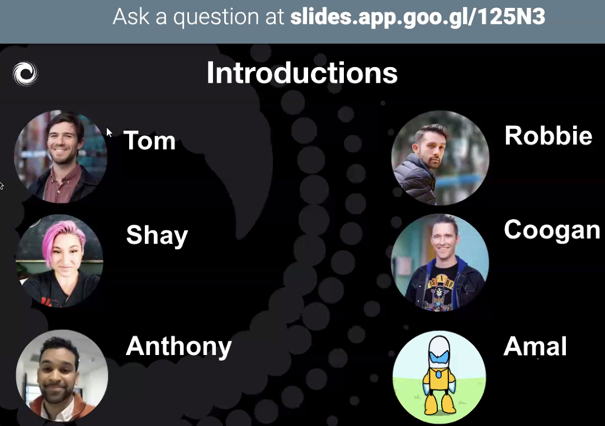
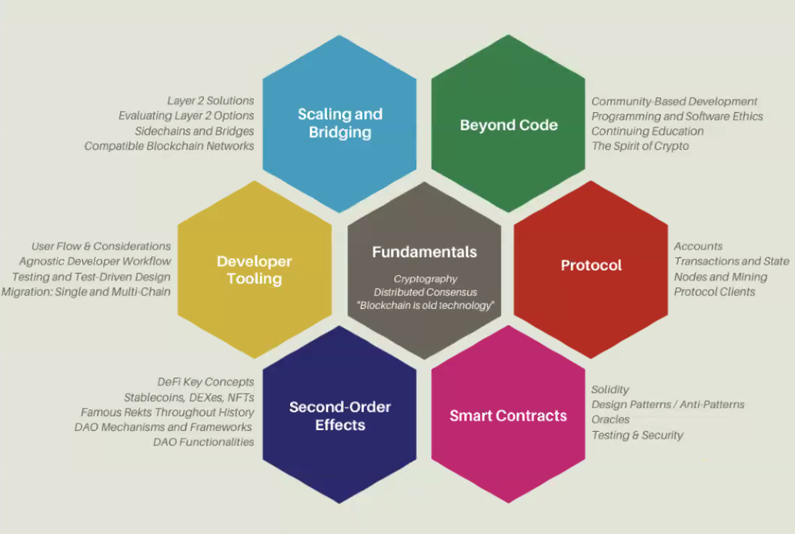
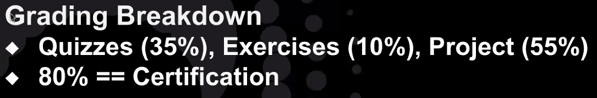

# 2021 Blockchain Developer Bootcamp Kick-Off

## Speakers

1. Coogan Brennan

Other instructors:

Weekly Sessions / Office Hours - Go over relevant material, discussion, Q&A

Mentors are alumni of past bootcamps

## Course Material

1. Fundamentals
2. Protocol
3. Smart Contracts
4. Dev Tooling
5. Second Order Effects
6. Scaling and Bridging
7. Beyond Code

## Grading

Can take quizzes as often as needed.
Everything is due Nov 30, 2021.
Follow the suggestions to build the Final Project in stages.
At end of course weekly sessions focused on Final Project.

## Q&A

[State and Blockchain](https://consensys.net/blog/blockchain-explained/want-to-really-understand-blockchain-you-need-to-understand-state/)

Final Project - make a certifcation app that Concensys class can use.
    Features - User has a form to enter name title etc. to issue the NFT

1100 students

Example of projects?

HIGHLY encourage to join study sessions

## My Goals
1. Build an NFT project
2. Document key concepts that I can quickly refer to to prepare for job interviews or as a reference when coding