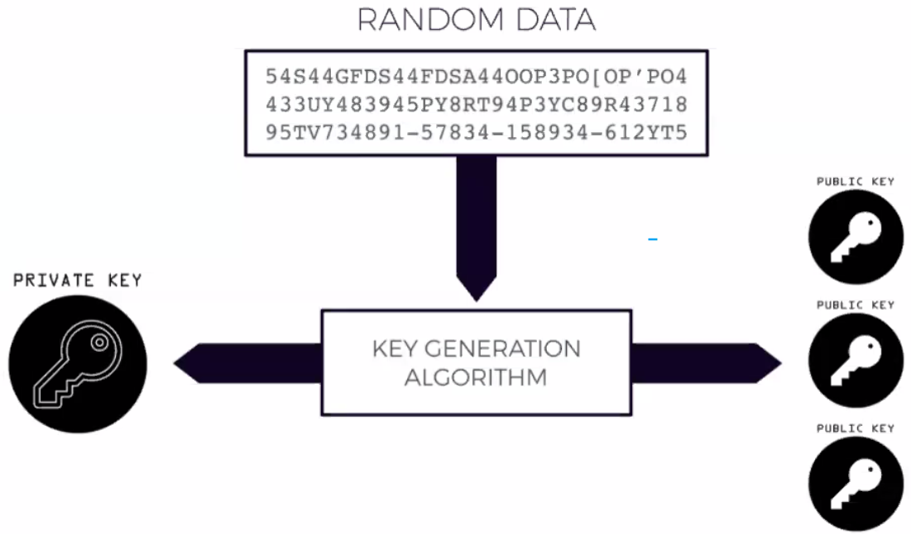
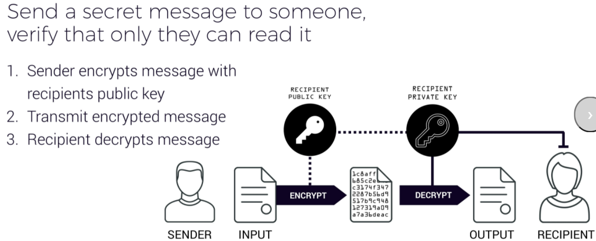
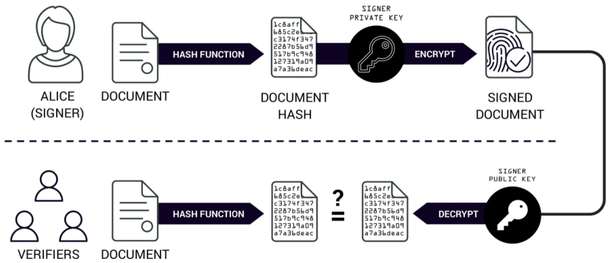
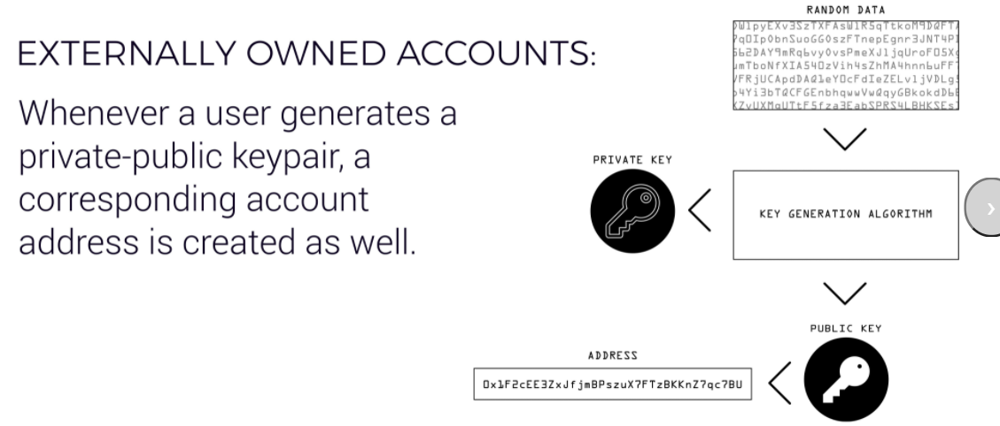
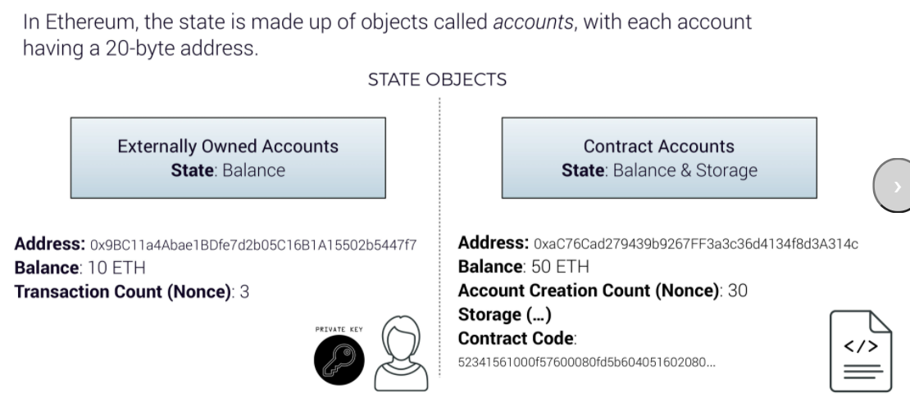

# 09-08-CryptographicFundamentalsAndMetaMask

[Week 1 Study Guide](https://docs.google.com/document/d/1VFhMf8QKGTr52wwgD-0VX14WTqo7_qTBF83KkgVk3As/edit#heading=h.eureleju6pex)

## Keys
https://ethereum-101.netlify.app/

## Use Cases

### Encryption

1. Private Key owner sends out their public keys
2. The people with these public keys can use the key to encrypt the message that only the Private Key owner can decrypt
   
"Super Secret Message" -> Encrypted by Public Key -> "343DFSFSDG$fd$%$%DF#" -> Sent over unsecured network -> Decrypted by Private Key

### Authentication

1. Private key encrypts message that public key can decrypt
2. This means that people who can decrypt your message knows that the message came from you and only you.

Can you use this to sign a document for example.

### Ethereum Private Key - Public Key - Accounts

The Eth Address is a proxy for the Public Key

## MetaMask

Secret Backup Phrase -> Private Key 

Todo
1. Create new Google Account and associated Metamask

2. Use Brave

3. MetaMask wallet vs account
    wallet is the bucket (seed phrase opens up wallet)
    account are the pages

https://faucet.ropsten.be/

