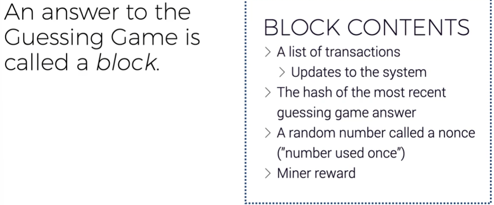

# Blockchain Developer Online Bootcamp 2021 with Certification

[Homepage](<[Homepage](https://courses.consensys.net/courses/blockchain-developer-bootcamp-registration-2021)>)

## Introduction

About This Course

Why Learn Blockchain?

Tips for This Course

Technical Requirements

[Keeping Up With Blockchain Developments](https://github.com/ConsenSys-Academy/Blockchain-Developer-Bootcamp/edit/main/docs/S00-intro/L6-keeping-up/index.md)

[For Advanced Students](https://github.com/ConsenSys-Academy/Blockchain-Developer-Bootcamp/edit/main/docs/S00-intro/L7-advanced-students/index.md)

What's Exciting About Blockchain:

1. Digital Scarcity / Uniqueness / Value
2. Removes middleman / power into users/distributes the power to individuals
3. Users control their own data

## Chapter 1: Fundamentals

### A Paper Blockchain

### Introduction

### Decentralizing Identity: Public Key Cryptography

Cryptography = "Hidden Writing"

Bob generates 2 related large numbers, a Private Key and a Public Key.

1. Public Key is used to encrypt - Public Key is given out freely to anyone who wants to send an encrypted message to Bob. No one can decrypt the message but Bob.
2. Private Key is used to decrypt - Private Key can be used to decrypt a message/file that the Public Key encrypted.

Interestingly, even the person who encrypted the message with my Public Key cannot reverse engineer the Public Key to find the Private Key.

For example: The Private Key are the primes of a large number. That large number can be used to transform/encrypt a message with a certain pattern.

1. The Private Key (the primes) can be used to generate the Public Key (the large number)
2. But having the large number, you cannot get the Primes.
3. [] The Private Key somehow? is able to decrypt the message?
4. Also, the Private Key can generate multiple public keys (like in Ethereum)? Each can just be a subset of a larger sets of Private Keys?

### Additional Material: Working With Private and Public Keys

[Resources](https://github.com/ConsenSys-Academy/Blockchain-Developer-Bootcamp/edit/main/docs/S01-fundamentals/M1-cryptography/L2-pub-key-crypto-additional/index.html)

### Decentralizing File Integrity: Hash Functions

Hash functions takes inputs(files, strings, images) and returns output as a hexadecimal.

Properties of Hash Functions:

1. Deterministic - Same input produces same output
2. Similar inputs produces completely different outputs
3. Low chance of collisions - two different inputs to not have the same outputs
4. Unidirectional (Irreversible) - cannot use the output to determine the input
5. Speed - low computation power to generate hashes

Usage of Hash functions

1. Store passwords as hashes
2. Comparing legal documents to make sure that they were not modified
3. Comparing NFT files on IPFS to make sure that they were the original/not switchedout or modified

### Additional Material: Hash Functions

### Decentralizing Intent: Digital Signatures

Private Key can be used to encrypt data also. That the Public Key can be used to decrypt. This allow you to prove that it is you who signed that message.

Scenario: Alice wants Bob to send her a 400 page legal document, and she wants to make sure that what she receives has not been tampered with, that she is receiving what Bob sent.

1. Bob has the Private Key.
2. Alice has the Public Key.
3. Bob creates a hash of the large document.
4. Bob encrypts the hash with his Private Key.
5. Bob sends the encrypted hash with the document to Alice over unsecured channel.
6. Alice can decrypt the hash with the Public Key.
7. Alice then take a hash of the document and compare the two hashes. If they match then she knows it came Bob and unaltered.

### Additional Material: Digital Signatures

### Cryptography Fundamentals Playground

[Resources](https://github.com/ConsenSys-Academy/Blockchain-Developer-Bootcamp/blob/main/docs/S01-fundamentals/M1-cryptography/L7-crypto-fundamentals-playground/index.html)

<li><a href="https://github.com/cooganb/bitcoin-whitepaper-exercises" target="_blank" rel="noopener noreferrer">Bitcoin White Paper Exercises</a> These are a series of exercises, built by <a href="https://github.com/getify" target="_blank" rel="noopener noreferrer">Kyle Simpson,</a> for understanding some of the concepts outlined in the Bitcoin white paper. These are not easy, but if you really would like to understand these fundamentals as they apply to blockchains, this is a great place to start.</li>

<li><a href="https://cryptohack.org/" target="_blank" rel="noopener noreferrer">CryptoHack</a> "A fun free platform for learning modern cryptography"</li>

<li><a href="https://app.hackthebox.eu/" target="_blank" rel="noopener noreferrer">Hack the Box</a> A gamified, cybersecurity platform. Not cryptography, per se, but cyber security which is a related field.</li>

<li><a href="https://cryptopals.com/" target="_blank" rel="noopener noreferrer">CryptoPals</a> This is <i>very</i> advanced and intense, but real to-the-metal applied cryptography! I am putting this link in here and it scares me.</li>

### Historical Background: When Asymmetric Cryptography Was Almost Made Illegal

### Video: The Crypto Wars of the 1990s

### Decentralizing Coordination: Consensus

### Additional Material: Consensus

### External Resource: The Secret Lives of Data: Raft Algorithm

### Trustless Consensus

### What is a Block?

The block hash below the difficulty threshold? y then block is valid.
Miners keeps changing the data (the nonce) until hash of the transactions in the bloack + the nonce is below difficulty threshhold.

About 1 in 40 years to find a block with 1 curent mining gpu.

### A Chain of Blocks

Hard to change a block because of chaining. Need a lot of power to change a block as well as the rest of the blocks by finding the hashes for all of them. While the other chain is longer and keeps moving forward.
### Proof of Work in Ethereum

### What is a Blockchain Fork?

Forks can occur when using different software - that disagrees on the state of the chain.

new rules are a subset (stricter than old rules) leads to soft"fork". Old software accepts both old and new, but new software only accepts blocks from new software. If a certain amount / percent of miners uses new software then old rules no longer accepted.

### Other Blockchain Consensus Mechanisms

### Consensus Conclusion

### The Mental Model for Basic Blockchain Architecture

### Configurations for Different Blockchain Networks

### Public and Private Blockchains

### When To Use a Blockchain?

### History and Development of Bitcoin

### What is a Crypto Wallet?

### Introduction to MetaMask

### How Does MetaMask Keep Your Wallet Safe?

### Secure, Extensible Javascript: How MetaMask is Locking In and Building Out

### Workshop: Setting up MetaMask and Sending Your First Digital Transaction

### How to Stay Safe Using Cryptocurrencies

### Chapter 1 Test (Graded)

%100

### Exercise: Your Final Project Idea

[instructions](https://courses.consensys.net/courses/take/blockchain-developer-bootcamp-registration-2021/surveys/26729108-exercise-your-final-project-idea)

submit a Github link with a written idea for your project

## Chapter 2: Ethereum Basics

### Ethereum Background and History

### Identity on Ethereum: Externally Owned Accounts (EOAs) and Smart Contracts

### Generating Ethereum Addresses

### Nodes

### Transactions

### Gas and Fees

### Ethereum Structure

### Sending Transactions

### Merkle Trees

### Playing with Merkle Trees

### EIP-1559

### What is an Ethereum Client? Running Hyperledger Besu -

### Workshop: Working with Hyperledger Besu

## Chapter 3: Smart Contracts

### Smart Contracts: What Are They? How Do They Fit In Our Mental Model?

### Smart Contracts and the EVM

### Introduction to Remix

### Introduction to Truffle Suite — Part 1

### Introduction to Truffle Suite — Part 2

### Solidity Background and Context

### Solidity Data Types and Variables

### Solidity Functions

### Solidity Storage and Memory

### Solidity Contract Structure

### Smart Contract ABI

### Solidity Events and Logs

### Solidity Factory Contracts

### (EXTERNAL) Solidity by Example (solidity-by-example.org/)

### Python in Ethereum: Background and Context

### Vyper Overview

### Design Patterns: Introductory Smart Contracts

### Inter-Contract Execution — Part 1

### Inter-Contract Execution — Part 2

### Inheritance and Interfaces

### Off-Chain Oracles

### Contract Workshop: ERC-20, 721 and 1155

### Access Control Design Patterns

### General Finance and Access Control: Multi-Sig Tutorial

### Upgradable Contracts

### Additional Material: Upgradable Contracts

### Optimizing Gas

### Smart Contract System Design

### Tutorial: Proof of Existence

### Introduction to Smart Contract Exercises

### Simple Bank Exercise (Graded)

### Supply Chain Exercise (Graded)

### Solidity Test (Graded)

### Smart Contract Test (Graded)

### Smart Contract Best Practices

### Solidity Pitfalls and Attacks

### Smart Contract Pitfalls and Attacks

### Smart Contract Safety Checklist

### tx.origin Attack Demo

### Denial of Service Attack Example

### Reentrancy Attack Example

### Integer Under- / Overflow Example

### Security: Introduction to Diligence, MythX and Scribble

### Scribble to Start Fuzzing

### Other Security Options

### Exercise: Your Final Project's Solidity Scaffolding

## Chapter 4: Developer Tooling

### Where Do Users Fit In Our Mental Model?

### Features of Decentralized Application Development

### Traditional vs Decentralized Development

### Agnostic Developer Workflow

### Web 3 Javascript Libraries (Web3.js and ethers.js)

### Connecting to a Smart Contract Using Web3.js

### Introduction to Infura

### TDD and Truffle Tests

### Truffle Debugger, Configuration, Mainnet Forking

### Other Development Tools: Hardhat, Scaffold-Eth, Brownie, etc

### Building a Frontend Interface with React and Truffle

### State Management in a Dapp with web3-react

### Frontend UI with Drizzle -

### Exercise: Build the Frontend For Your Final Project

## Chapter 5: Second-Order Effects (DeFi and DAOs)

### Introduction to "Second-Order Effects"

### What is DeFi?

### Key Terms

### What are Stablecoins?

### NFTs: More than Solidity Code

### What are Wrapped Tokens?

### What are DEXes?

### What are AMMs?

### What are RFQs?

### Oracles Revisited

### What are DeFi Lending Markets?

### What are Governance Tokens?

### Introduction to MetaMask Swaps

### DAOs in Today's World: Not Your Millennial Sibling's DAO -

### DAO Frameworks -

### DAO Management Tools -

### What Can DAOs Do? -

## Chapter 6: Additional Topics

### Introduction to IPFS

### Filecoin

### Ethereum Name Service

### The Graph

### Zero-Knowledge Proofs

### MetaMask Snaps

## Chapter 7: Layer 2 (L2) or Scalability Solutions

### Overview of L2 Solutions

### Types of L2 Solutions

### Rubric for Evaluating L2 Solutions

### L2 Examples: Optimism

### Optimism

### Arbitrum

### Crosschain and Interoperability

## Chapter 8: Ethereum 2.0 or The Merge

### History and Roadmap

### Key Terms

### Future Considerations

### Running Your Own Validator Node

## Chapter 9: What Now?

### Beyond Code: Community, Contributing and Conscience

## Final Project

### Final Project
